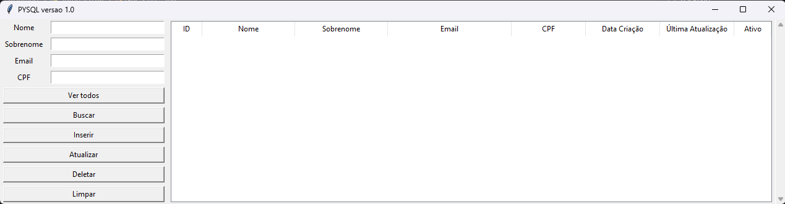

# **Client Data Governance**  

## **📌 Visão Geral**  
Este projeto é um **MVP (Minimum Viable Product)** de um sistema de **governança de dados** para gestão de informações de clientes, com foco em:  
✅ **Validação e qualidade de dados** (CPF, e-mail, normalização de nomes)  
✅ **Rastreabilidade e auditoria** (logs detalhados de todas as operações)  
✅ **Anonimização de dados sensíveis** (proteção de PII - Informação Pessoal Identificável)  
✅ **Soft Delete** (preservação de histórico sem excluir dados permanentemente)  
✅ **Arquitetura extensível** (frontend/backend separados)

---
## **Observação** 
Este projeto é uma evolução de um projeto anterior que consistia em um sistema básico de gerenciamento de clientes - um projeto simples, mas completo, com operações CRUD usando Tkinter e SQLite (que depois alterei para PostgreSQL).

[Repositório do projeto base](https://github.com/GiovanaHoffmann/CrudClientes.git)
---

## **📂 Estrutura do Projeto**  

```plaintext
client-data-governance/
│── .env                     # Configurações de ambiente (banco de dados)
│── README.md                # Documentação principal
├── backend/
│   ├── database.py          # Conexão com PostgreSQL
│   ├── models.py            # Definição das tabelas (clientes + audit_log)
│   ├── operations.py        # Operações CRUD com validações
│   ├── data_quality.py      # Normalização, validação e anonimização
│   └── audit_log.py         # cria histórico alterações para auditoria
├── frontend/
│   ├── app.py               # Lógica da interface
│   └── interface.py         # UI com TKinter
└── scripts/
    ├── init_db.py           # Inicializa o banco de dados
    └── backup_db.py         # Script de backup (exemplo de extensibilidade)
```

---

## **⚙️ Bibliotecas Principais:**
- `validate-docbr` para CPF
- `email-validator` para e-mails
- `psycopg2` para PostgreSQL
- `python-dotenv` para variáveis de ambiente
- `TKinter` para interface gráfica
---

## **🔧 Funcionalidades Principais**  

### **1. Validação e Qualidade de Dados**  
- **CPF**: Validação usando `validate-docbr`  
  ```python
  if not DataQuality.validate_cpf("123.456.789-09"):
      raise ValueError("CPF inválido!")
  ```
- **E-mail**: Checagem de formato com `email-validator`  
- **Nomes**: Normalização automática  
  ```python
  nome = DataQuality.normalize_name("joÃO  silVA")  # → "João Silva"
  ```

### **2. Auditoria e Rastreabilidade**  
Todas as operações são registradas na tabela `audit_log`:  
```sql
INSERT INTO audit_log (operacao, tabela, id_registro, dados_antigos, dados_novos)
VALUES ('UPDATE', 'clientes', 123, '{"nome": "João"}', '{"nome": "José"}');
```
**Exemplo de log anonimizado**:  
```json
{
  "operacao": "UPDATE",
  "dados_antigos": {"email": "jo***@gmail.com"},
  "dados_novos": {"email": "jo***@outlook.com"}
}
```
### **3. Soft Delete**
O sistema nunca apaga registros completamente, apenas marca como inativo:
```sql

  UPDATE clientes SET ativo = FALSE WHERE id = 123;

```

### **5. Backup Automatizado**
```bash
  python scripts/backup_db.py

```

## **6. Módulo de Segurança de Dados**
- **Anonimização inteligente**:
  ```python
  # Exemplo: anonimiza mantendo últimos 2 caracteres
  DataQuality.anonymize_data("123.456.789-09")  # Retorna "***.***.***-09"
  ```
- **Validação em duas etapas** (frontend e backend)
- **Proteção contra SQL Injection** (prepared statements)


### **6. Interface de Gestão (TKinter)**  
- **Cadastro** com validação em tempo real  
- **Busca flexível** (por nome, CPF parcial, etc.)  
- **Visualização de logs** (para fins de auditoria)  

  

---

## **🎯 Casos de Uso Possíveis - Exemplos Ilustrativos**  

### 1. **Instituição Financeira (LGPD Compliance)**
#### **📋 Desafio**  
Solução para bancos digitais que necessitam:
- Cumprir regulamentações de proteção de dados (LGPD)
- Eliminar cadastros fraudulentos e duplicados
- Manter histórico completo de alterações

#### **🛠️ Aplicação do Sistema**  
| Funcionalidade              | Benefício Concreto                          | Exemplo Prático                     |
|-----------------------------|--------------------------------------------|-------------------------------------|
| Validação automática de CPF | Bloqueia 100% dos documentos inválidos     | Rejeita CPFs como "111.111.111-11" |
| Auditoria                   | Logs detalhados para compliance            | Rastreia quem alterou um e-mail     |
| Máscara de dados sensíveis  | Proteção PII em relatórios                 | Exibe "Ana S***" em telas públicas  |

### 2. **Sistema de Saúde (HIPAA Compliance)**
#### **📋 Desafio**  
Clínicas e hospitais que precisam:
- Proteger informações médicas sensíveis
- Validar documentos do SUS/CNS
- Garantir rastreabilidade de acessos

#### **🔍 Adaptação Necessária**  
```python
# Extensão para validação de CNS
class HealthDataQuality(DataQuality):
    @staticmethod
    def validate_cns(cns: str) -> bool:
        return len(cns) == 15 and cns.isdigit()
```

### 3. **Varejo Inteligente**
#### **📋 Desafio**  
Redes varejistas que buscam:
- Unificar cadastros de múltiplas lojas
- Identificar clientes únicos
- Analisar padrões de compra

#### **📊 Benefício Chave**  
```sql
-- Análise de clientes únicos
SELECT COUNT(DISTINCT cpf) FROM clientes WHERE ativo = TRUE;
```

---

## **🚀 Como Executar o Projeto**

### **Pré-requisitos**
- Python 3.8 ou superior instalado
- Servidor PostgreSQL rodando localmente
- Pacotes necessários listados no `requirements.txt`

### **Passo a Passo**

1. **Preparar o ambiente**:
   ```bash
   # Clone o repositório (caso não tenha feito)
   git clone https://github.com/GiovanaHoffmann/DataGuard_CRUD.git
   cd DataGuard_CRUD
   
   # Crie e ative um ambiente virtual (recomendado)
   python -m venv venv
   source venv/bin/activate  # Linux/Mac
   venv\Scripts\activate     # Windows
   ```

2. **Instalar dependências**:
   ```bash
   pip install -r requirements.txt
   ```

3. **Configurar o banco de dados**:
   - Crie um banco chamado `client_governance` no seu PostgreSQL
   - Edite o arquivo `.env` com suas credenciais:
     ```env
     DB_NAME=client_governance
     DB_USER=seu_usuario
     DB_PASSWORD=sua_senha
     DB_HOST=localhost
     DB_PORT=5432
     ```

4. **Inicializar a estrutura do banco**:
   ```bash
   python scripts/init_db.py
   ```

5. **Iniciar a aplicação**:
   ```bash
   python frontend/app.py
   ```

6. **Acessar a interface**:
   - A aplicação iniciará automaticamente na interface gráfica
   - Use os campos e botões para gerenciar os clientes
   - 

---

## **📌 Valor para Engenharia de Dados**  
- **Demonstra competências como**:  
  - Governança de dados  
  - Modelagem dimensional (básico neste projeto)
  - Pipelines de qualidade (básico neste projeto)
  - Proteção de PII  